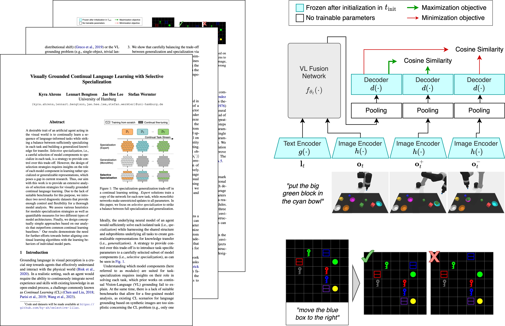

# Visually Grounded Continual Language Learning with Selective Specialization

## Official code repository for the Findings of ACL: [EMNLP 2023](https://2023.emnlp.org) paper:

Kyra Ahrens, Lennart Bengtson, Jae Hee Lee, and Stefan Wermter (2023). "Visually Grounded Continual Language Learning with Selective Specialization."

[Paper](https://arxiv.org/abs/2310.15571) • [LILAC-2D Download](https://www2.informatik.uni-hamburg.de/wtm/datasets2/lilac-2d.zip) • [LILAC-3D Download](https://www2.informatik.uni-hamburg.de/wtm/datasets2/lilac-3d.zip)

## Overview



## Installation

To execute the following commands sequentially:

```bash
git clone https://github.com/ky-ah/selective-lilac.git
cd selective-lilac
pip install -r requirements.txt
```

The dataset will be automatically downloaded to the data directory as specified in `conf/config.yaml`.

## Quickstart

Here are two exemplary commands with different model architectures, datasets, and specialization strategies. **For more configurations, check `config.yaml` file.**

FiLM / LILAC-2D / Convolutions in last FiLMed block specialized:
```bash
python train.py arch=film dataset=lilac-2d strategy=conv1-conv2-fourth-layer
```
VL-Transformer / LILAC-3D / Attention weights in all layers specialized:
```bash
python train.py arch=transformer dataset=lilac-3d strategy=self-attn-all-layers
```

## Additional info
- More strategies for specialization of modules can be found (and added!) in `utils/specialization.py`.
- To use a GPU, please specify the torch device / GPU ID, e.g. `device=gpu:0`, otherwise `device=cpu` for CPU computing. 
- Executing the code as described above automatically downloads, extracts, and loads the LILAC-2D/LILAC-3D datasets. If manual download is desired, the datasets can be accessed by clicking on one of the download URLs provided at the top of this page. 

## Cite our work

If you find our work on continual learning of visually grounded language useful, please cite our work:
```bash
@proceedings{ahrens-etal-2023-selective-lilac,
    title = "Findings of the Association for Computational Linguistics: EMNLP 2023",
    author = "Ahrens, Kyra and Bengtson, Lennart and Lee, Jae Hee and Wermter, Stefan",
    month = dec,
    year = "2023",
    publisher = "Association for Computational Linguistics"
}
```

